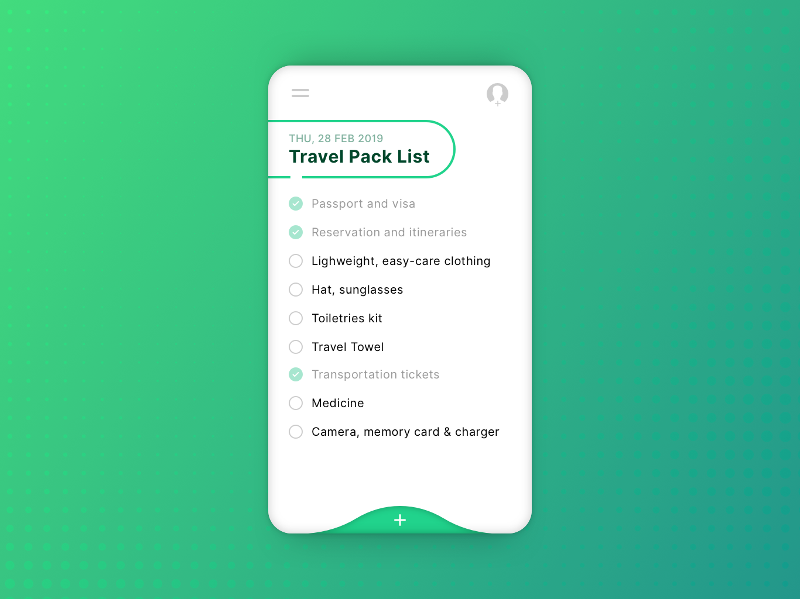
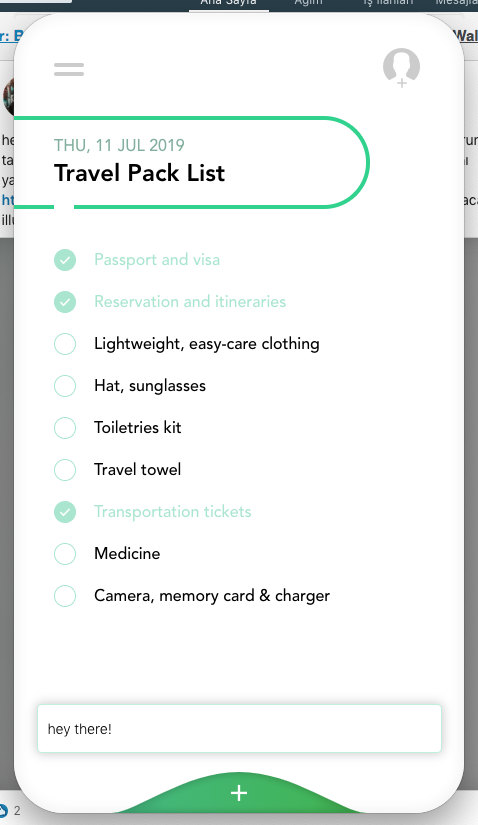

# simple-todo

## Screenshot


<center>

</center>

```
source -> https://dribbble.com/shots/6123325-Daily-UI-042-ToDo-List
```

## Project setup
```
npm install
```

### Compiles and hot-reloads for development
```
npm run serve
```

### Compiles and minifies for production
```
npm run build
```

### Run your desktop with Electron
```
npm run dev
```

### Run your tests
```
npm run test
```

### Lints and fixes files
```
npm run lint
```
